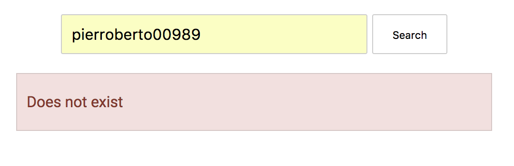

# Search Github Repos

Search Github Repos allows the user to look for users in Github and see the list of their projects. All you need is to type the correct username of the person you are looking for and then click on the Search button in order to display the results.




# Installation

* Clone the repo and cd into it
* ```npm install```
* Run ```python -m SimpleHTTPServer 1337```

In order to run the the tests:

* ```npm test```

# Tech Stack

* Javascript